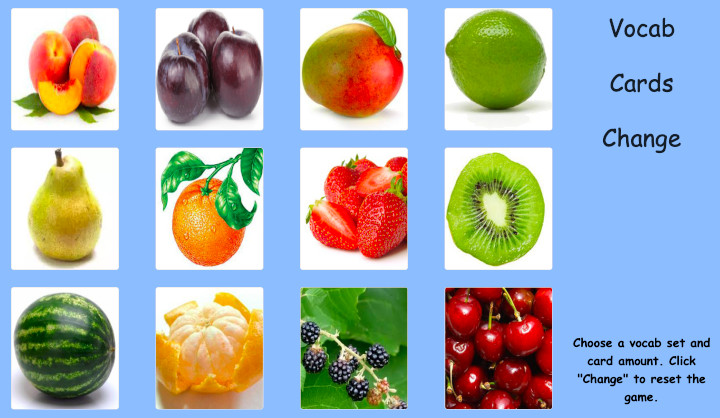

# [Hiding Spot Game](https://teflassistant.com/hiding-spot-game/)
Hiding spot game for building vocabulary.

## Purpose/Goal
To supplement simple lessons at elementary schools with an easy to use vocabulary building game.

## Operation
* choose the card count from the "Cards" link.
* choose the vocabulary from the "Vocab" link.
* click the "Change" link to shuffle and reset the cards.
* when you leave the game board, a "Game" link will appear to allow you to return to the game in play.

## Tech/Libraries Used
* HTML
* CSS
* JavaScript
* React

## Problems/Solutions
* This app is not meant for small screens. Maybe I will adapt for small screens later, but that is not a high priority for me now.

## More Information
N/A
